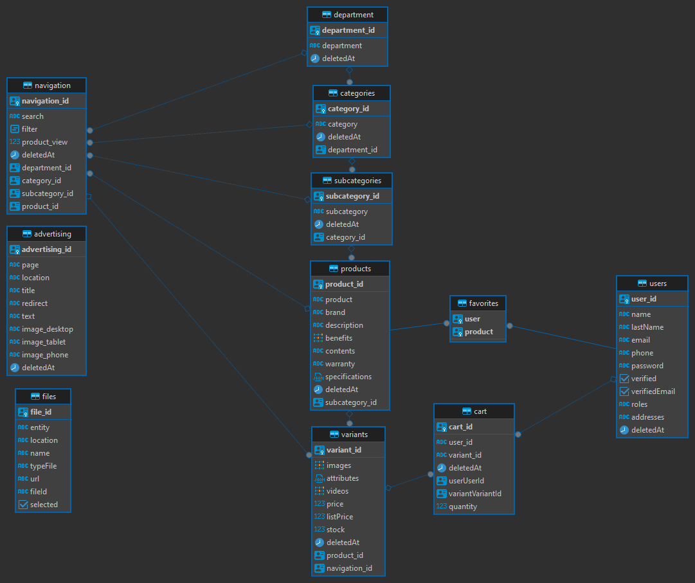

# Proyecto Practica de conocimiento

## Objetivos del Proyecto

El objetivo principal de este proyecto es aplicar y practicar mis conocimientos en desarrollo web. Aunque el proyecto aún no está finalizado, se ha avanzado considerablemente en la parte de visualización del cliente. Pueden acceder al desarrollo en producción a través de este enlace:  [https://e-commerce-hilde.vercel.app/](https://e-commerce-hilde.vercel.app/).

Este proyecto ha involucrado una variedad de tecnologías que se han modificado y adaptado a lo largo del tiempo para satisfacer las necesidades del proyecto, las ultimas tecnologías están en la sección de **Tecnologías**.

Para mantener una organización clara del desarrollo y gestionar las tecnologías utilizadas, he creado varias ramas en el repositorio. Cada rama contiene tecnologías específicas que se han retirado del proyecto pero que podrían ser útiles para futuras referencias, las tecnologías retiradas son las siguientes:

- React Redux
- MongoDB
- Mongoose


## Estructura del proyecto

Cuenta esta dividido en tres carpetas: `api` (backend), `server_files` (servidor de archivos) y `client` (Frontend).

## Tecnologías

#### Frontend
Esta desplegado en Vercel

```json
 "dependencies": {
    "@tanstack/react-query": "^5.18.0",
    "react": "^18.2.0",
    "react-router-dom": "^6.21.1",
    "sass": "^1.69.5",
    "typescript": "^4.9.5",
    "yup": "^1.3.3"
  }
```

#### Backend
Esta desplegado en AWS

```json
 "dependencies": {
      "axios": "^1.6.7",
      "bcrypt": "^5.1.1",
      "body-parser": "^1.19.1",
      "cors": "^2.8.5",
      "dotenv": "^16.3.1",
      "express": "^4.17.2",
      "fs-extra": "^11.2.0",
      "jsonwebtoken": "^9.0.2",
      "morgan": "^1.10.0",
      "multer": "^1.4.5-lts.1",
      "nodemailer": "^6.9.9",
      "pg": "^8.4.0",
      "pg-hstore": "^2.3.4",
      "reflect-metadata": "^0.1.13",
      "resend": "^3.2.0",
      "typeorm": "0.3.17",
      "uuid": "^9.0.1",
      "yup": "^1.3.3"
   }
```

#### Server Files
Esta desplegado en AWS

```json
"dependencies": {
      "axios": "^1.6.7",
      "body-parser": "^1.19.1",
      "cors": "^2.8.5",
      "dotenv": "^16.3.1",
      "express": "^4.17.2",
      "fs-extra": "^11.2.0",
      "morgan": "^1.10.0",
      "multer": "^1.4.5-lts.1",
      "pg": "^8.4.0",
      "pg-hstore": "^2.3.4",
      "reflect-metadata": "^0.1.13",
      "typeorm": "0.3.17",
      "uuid": "^9.0.1",
   }
```

## Base de datos
Esta desplegado en AWS

La base de datos que se esta utilizando es PostgreSQL

<p align="center">
  
</p>
